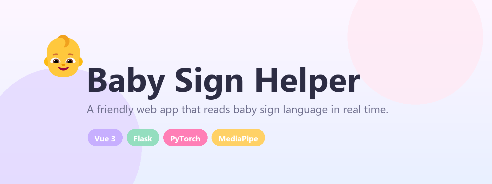
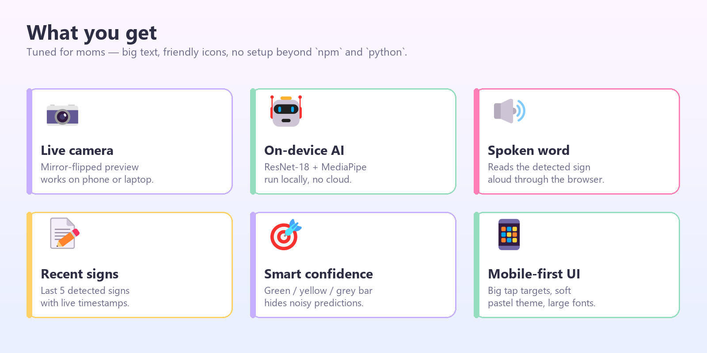
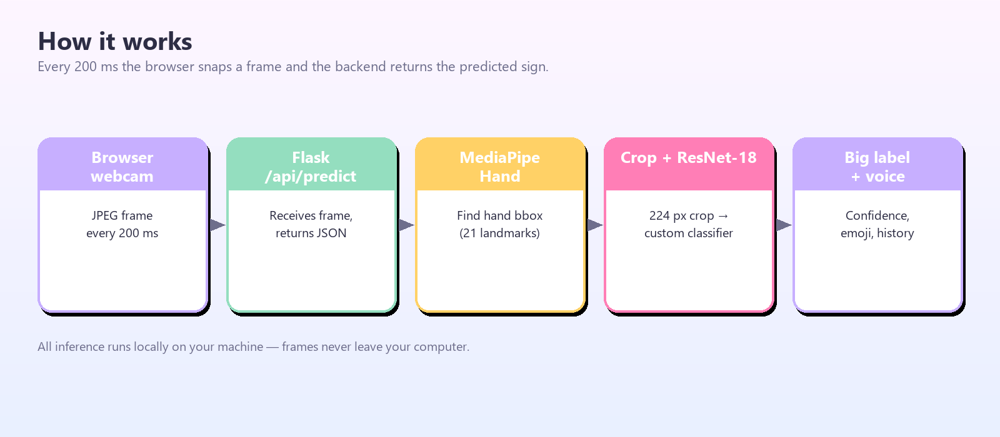
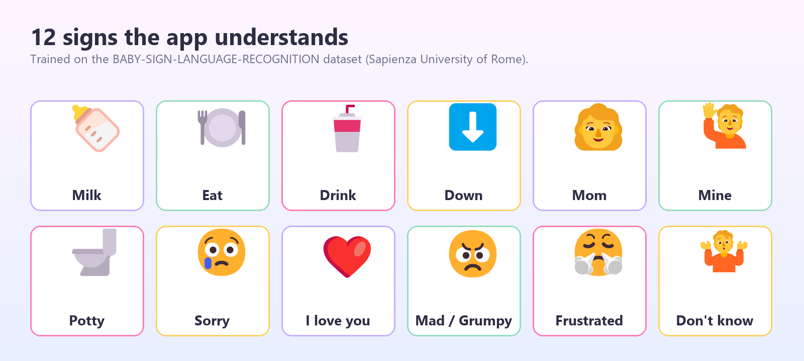

<p align="center">
  
</p>

<p align="center">
  <a href="#-quick-start"></a>
  
  
  
  
  
</p>

<p align="center">
  <b>A friendly web app that reads baby sign language in real time.</b><br>
  Point your camera at your baby's hand, and the app shows the word, speaks it aloud, and keeps a short history.
</p>

---

## ✨ What is this?

Babies sign before they speak. This app puts a research-grade sign-language classifier behind a UI any parent can use — open a webpage, click **Start camera**, and start understanding.

It's built on top of the [BABY-SIGN-LANGUAGE-RECOGNITION](https://github.com/RoxyDiya/BABY-SIGN-LANGUAGE-RECOGNITION) research project from Sapienza University of Rome (ResNet-18 trained on 12 baby sign-language gestures), wrapped in a Vue 3 + Flask web app with hand detection, voice playback, and a mom-friendly UI.

<p align="center">
  
</p>

---

## 🏗 How it works

<p align="center">
  
</p>

| Step | Component | Detail |
|---|---|---|
| 1 | **Browser** | `getUserMedia` grabs a webcam frame every 200 ms and `canvas.toDataURL('image/jpeg')` encodes it. |
| 2 | **Flask `/api/predict`** | Receives the base64 JPEG, decodes it to a numpy BGR array. |
| 3 | **MediaPipe HandLandmarker** | Finds the dominant hand and returns 21 landmarks → tight bounding box. |
| 4 | **Crop → ResNet-18** | The hand crop is resized to 224×224, ImageNet-normalized, and run through the custom-headed ResNet-18. |
| 5 | **Frontend** | Top-1 label + confidence is rendered as a big emoji card, spoken aloud (≥ 80 % confidence) and added to history. |

Everything runs locally — frames never leave your machine.

---

## 🤟 12 signs the app understands

<p align="center">
  
</p>

| Label | Sign | Label | Sign | Label | Sign |
|---|---|---|---|---|---|
| 🍼 | milk      | 🍽️ | eat        | 🥤 | drink |
| ⬇️ | down      | 👩 | mom         | 🙋 | mine  |
| 🚽 | potty     | 😢 | sorry       | ❤️ | i_love_you |
| 😠 | mad_grumpy | 😤 | frustrated | 🤷 | dont_know |

---

## 🚀 Quick start

### Prerequisites
- **Python 3.11–3.13** (PyTorch wheels available)
- **Node.js 18+** and **npm**
- A webcam and a modern browser (Chrome, Edge, Firefox, Safari)

### 1 · Backend (Flask)

```bash
cd backend
pip install -r requirements.txt
python app.py
```

On first run, two files are auto-downloaded:

- `models/signlanguage_model.pth` (~ 44 MB, from the original research repo)
- `models/hand_landmarker.task` (~ 8 MB, from Google's MediaPipe model zoo)

You'll see:
```
Loading model...
Model ready. Starting Flask on http://localhost:5000
```

### 2 · Frontend (Vue + Vite)

In a second terminal:

```bash
cd frontend
npm install
npm run dev
```

Open **http://localhost:5173**, click **Start camera**, and allow camera access.

### Production build (single command)

```bash
cd frontend && npm run build      # produces frontend/dist/
cd ../backend && python app.py    # Flask now serves the built app on :5000
```

Open **http://localhost:5000**.

### Custom port

```bash
PORT=8080 python app.py            # macOS / Linux
$env:PORT=8080; python app.py      # PowerShell
set PORT=8080 && python app.py     # cmd.exe
```

---

## 📱 Android APK

The app can also be installed as a native Android app. The APK is built by GitHub Actions — no Android Studio or JDK needed locally.

### One-time setup

1. **Host the backend somewhere reachable from your phone.** Options:
   - Run `python app.py` on your PC; on your phone, use `http://<your-pc-LAN-ip>:5000` (same Wi-Fi).
   - Or deploy `backend/` to a free Python host (Render, Railway, Fly).
2. **Set the backend URL as a repository variable.** Go to **Settings → Secrets and variables → Actions → Variables**, then add:
   - Name: `VITE_API_BASE`
   - Value: e.g. `http://192.168.1.42:5000` or `https://baby-sign.example.com`

### Build the APK

Either push a commit (the workflow triggers on changes under `frontend/`) **or** manually:

1. Go to the **Actions** tab → **Build Android APK** → **Run workflow**.
2. Optionally override the API URL in the input box.
3. Wait ~3–5 minutes. Download `baby-sign-helper-debug-apk` from the run's artifacts.
4. Transfer the `.apk` to your phone, allow "install from unknown sources", and tap to install.

### What the workflow does

| Step | Detail |
|---|---|
| 1 | Checkout, set up Node 20 + JDK 21 + Android SDK |
| 2 | `npm ci && npm run build` (with `VITE_API_BASE` baked in) |
| 3 | `npx cap add android && npx cap sync` — generates the Android project from the built Vue app |
| 4 | Patches `AndroidManifest.xml` to add `CAMERA` permission |
| 5 | `./gradlew assembleDebug` — builds the APK |
| 6 | Uploads `app-debug.apk` as a workflow artifact |

The Android project (`frontend/android/`) is **not committed** — it's regenerated on every CI run.

---

## 🧠 How the UI thinks

| Confidence | UI behaviour |
|---|---|
| **No hand detected** | "Looking for hands… 👀" |
| **< 50 %**            | "Show me a sign 👋" — predictions hidden |
| **50 – 79 %**         | Yellow bar, label shown, not spoken |
| **≥ 80 %**            | Green bar, label spoken aloud + added to history |

Duplicate predictions are suppressed within a 2-second window for speech and 3-second window for history, so a sustained sign doesn't spam the UI.

---

## 📁 Project layout

```
baby-sign-language-webapp/
├─ backend/
│  ├─ app.py              ← Flask: /api/health, /api/predict, static SPA serve
│  ├─ model_loader.py     ← ResNet18 + auto-download of .pth weights
│  ├─ hand_detector.py    ← MediaPipe Tasks HandLandmarker wrapper
│  ├─ inference.py        ← decode → detect → crop → predict
│  └─ requirements.txt
├─ frontend/
│  ├─ index.html
│  ├─ vite.config.js      ← /api proxy → :5000
│  ├─ package.json
│  └─ src/
│     ├─ App.vue
│     ├─ main.js
│     ├─ style.css
│     ├─ components/
│     │  ├─ CameraView.vue
│     │  ├─ LabelCard.vue
│     │  ├─ HistoryStrip.vue
│     │  └─ SpeakToggle.vue
│     ├─ composables/
│     │  ├─ usePredictor.js
│     │  ├─ useSpeech.js
│     │  └─ useHistory.js
│     └─ constants/labels.js
└─ docs/
   ├─ hero.png
   ├─ architecture.png
   ├─ features.png
   └─ signs-grid.png
```

---

## 🛠 Tech stack

- **Frontend** — Vue 3 (Composition API), Vite, Web Speech API, `getUserMedia`
- **Backend** — Flask, Flask-CORS, PyTorch, torchvision, Pillow, OpenCV
- **Vision** — MediaPipe Tasks `HandLandmarker` for the 21-keypoint hand detection
- **Model** — ResNet-18 (ImageNet-pretrained backbone) with a custom 256-unit dropout head over 12 classes; weights from the original research repo

---

## 🙏 Acknowledgements

This web app stands on the shoulders of the original research project:

> **[BABY-SIGN-LANGUAGE-RECOGNITION](https://github.com/RoxyDiya/BABY-SIGN-LANGUAGE-RECOGNITION)**
> by Rokshana Ahmed, Elena Martellucci, and Firdaous Hajjaji
> — final project for AI LAB · Computer Vision, Sapienza University of Rome.

The model weights, the dataset, and the training pipeline are all theirs. This repo only adds the web UI on top.

---

## 📜 License

MIT — see [LICENSE](LICENSE).
